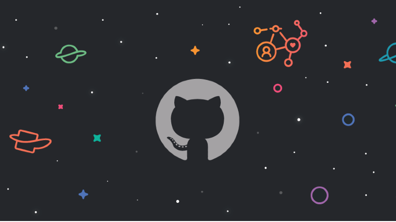

  

### Hi there, I'm Tharasari Lakruwani! 👋

  

---

### 🔹 About Me:
- 🎓 Software Engineering Undergraduate (2nd Year, 2nd Semester) from Sri Lanka 🇱🇰
- 💡 Enthusiastic about **Web Development, UI/UX, Full-Stack Development & Cybersecurity**
- 🌱 Currently learning **Full-Stack Development, Frameworks & Cybersecurity** 🛡️
- 💬 Ask me about **Java, C++, Python, React.js, Node.js & Databases**
- 📫 Reach me at **tharasari5@gmail.com**
- ⚡ Fun fact: I think I'm funny 😆

---

### 🛠️ Tech Stack:

#### 💻 Programming Languages:
  -  
  - 
  - 

#### 🌐 Web Development:
 
 
 
 

#### 🛠️ Tools & Platforms:
 
 
 
 

---

### 📊 GitHub Stats:

  

  

---

### 📢 Let's Connect:

  
  
  
  

---

⭐ **Thanks for visiting my GitHub profile!** 🚀
